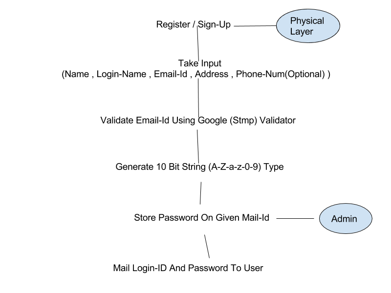
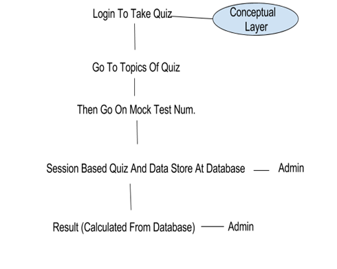

<h1>PROJECT REPORT ON ONLINE QUIZZING WEBSITE</h1>

<strong>Preksha Pandey</strong>

<h2>INTRODUCTION</h2>

Online Exams are being launched because there is a need for a website
that is beneficial for students who are preparing for JEE and other
similar exams. Often we have seen that the offline examination is time
consuming and the result is often delayed. With this site, students can
give exams and view their results. Thus the purpose of the site is to
provide a system that saves the efforts and time of the students and
providing all these services absolutely free of cost.

<h2>MINIMUM SOFTWARE REQUIREMENTS</h2>

<strong>Server used:</strong> [Wampserver 3.0.6 64 bit x64 - Apache 2.4.23 - PHP
5.6.25/7.0.10 - MySQL 5.7.14 - PhpMyAdmin 4.6.4 - Adminer 4.2.5 -
PhpSysInfo
3.2.5](http://wampserver.aviatechno.net/files/install/wampserver3.0.6_x64_apache2.4.23_mysql5.7.14_php5.6.25-7.0.10.exe).
WampServer refers to a [software
stack](https://en.wikipedia.org/wiki/Solution_stack) for the [Microsoft
Windows](https://en.wikipedia.org/wiki/Microsoft_Windows) operating
system consisting of the [Apache web
server](https://en.wikipedia.org/wiki/Apache_HTTP_Server), OpenSSL for
SSL support, [MySQL](https://en.wikipedia.org/wiki/MySQL) database
and [PHP](https://en.wikipedia.org/wiki/PHP) programming language.

<strong>Front-end:</strong> Front-end web development is the practice of producing HTML,
CSS and JavaScript for a website so that a user can see and interact
with them directly. The objective of designing a site is to ensure that
when the users open up the site they see the information in a format
that is easy to read and relevant.

<strong>Back-end:</strong> A back-end developer is a type of programmer who creates the
logical back-end and core computational logic of a website, software or
information system. The language used is PHP, also MySQL is an open
source relational database management system (RDBMS) based on Structured
Query Language (SQL).

<h2>MODULES</h2>

<h3>-   Admin Module</h3>

> Administrator Is The Main Head Who Can Create Questions, Solve Them ,
> Review Them, Add Them, Edit Them , View Them, Sort Them , Create Mock
> Tests , Create Test Bundle And respective Id’s , Give Access to,
> Physical Layer Of The System And More Importantly The Brain Of The
> Website.

<h3>-   Sign-Up Module</h3>

> The user opens the home page and then registers. He has to provide the
> Name, Username, e-mail address and then choose a password. Then query
> runs and the data is stored in the database table ‘users’. The user
> can then login in to his account and take an online quiz for Physics,
> Math and chemistry.

<h3>-   Online-Quiz Module</h3>

Choose to take a quiz for any subject and then select the topic to take
a quiz.

-   Update Password 

<h2>SCREENSHOTS</h2>

<h3>1\. Login Page</h3>

<h3>2\. Sign Up Page</h3>

<h3>3\. Home Page</h3>

<h3>4\. Choose Subject</h3>

<h3>5\. Select Quiz</h3>

<h3>6\. Quiz</h3>

